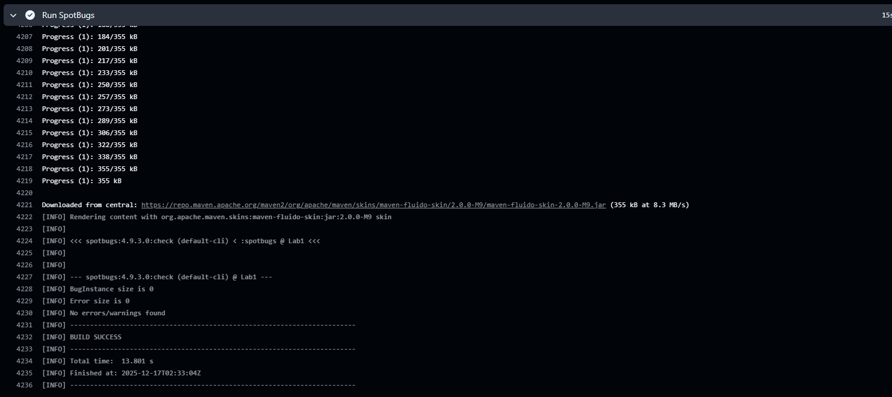
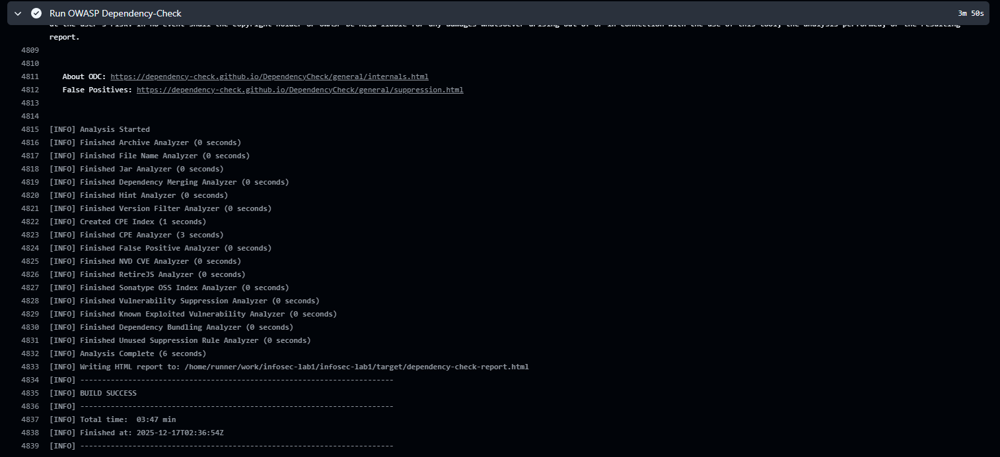

# Лабораторная работа №1 по Информационной безопасности

## Описание проекта

В проекте реализован REST API, позволяющий регистрировать пользователей, авторизовываться и получать доступ к данным.

Технологии:
- Java
- Spring Boot
- Spring Security
- JWT
- PostgreSQL
- Maven

## Эндпоинты

### Пример запроса на регистрацию

```
POST /auth/register
Content-Type: application/json

{
  "username": "alex",
  "password": "12345"
}
```

### Пример запроса на авторизацию

```
POST /auth/login
Content-Type: application/json

{
  "username": "alex",
  "password": "12345"
}
```

### Пример запроса на получение списка имен

```
GET /api/data
```

### Пример запроса hello

```
GET /api/hello
```

## Реализованные меры защиты

### Защита от SQL Injection

- Используется Spring Data JPA для работы с базой данных PostgreSQL
- Все запросы к базе данных формируются через JPA-репозитории, без конкатенации строк SQL
- Взаимодействие с БД происходит через параметризованные запросы, которые автоматически экранируют пользовательский ввод
- Пользовательские данные не подставляются напрямую в SQL-запросы

### Защита от XSS

- Приложение реализовано как REST API, которое возвращает данные в формате JSON и не формирует HTML-страницы
- Вводимые пользователем данные не интерпретируются как HTML или JavaScript-код
- Используется стандартная сериализация объектов Spring (Jackson), которая предотвращает внедрение скриптов в ответы API

### Аутентификация и авторизация

В проекте реализована аутентификация и авторизация на основе JWT (JSON Web Token):

- Пользователь проходит регистрацию с указанием логина и пароля
- Пароль пользователя хэшируется (алгоритм bcrypt) перед сохранением в базе данных
- При успешной авторизации сервер генерирует JWT-токен
- Токен передаётся клиенту и используется для доступа к защищённым эндпоинтам
- Все защищённые эндпоинты требуют наличия валидного JWT-токена

### Контроль доступа

- Публичные эндпоинты (`/auth/register`, `/auth/login`) доступны без аутентификации
- Эндпоинты бизнес-логики (`/api/**`) доступны только для аутентифицированных пользователей
- Контроль доступа реализован с помощью Spring Security и фильтра JWT

### Дополнительные меры безопасности

Используется Spring Security, обеспечивающий базовую защиту от распространённых веб-атак.

В проекте применяются инструменты статического и компонентного анализа безопасности:
- SpotBugs (SAST) — анализ исходного кода на наличие потенциальных уязвимостей
- OWASP Dependency-Check (SCA) — анализ сторонних библиотек на наличие известных уязвимостей

## Скриншоты отчетов

Отчет о прохождении SAST:



Отчет о прохождении SCA:


